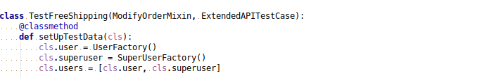
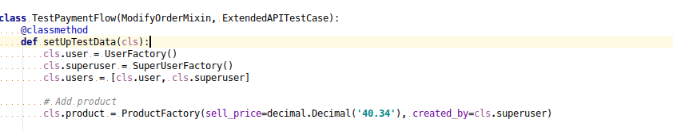
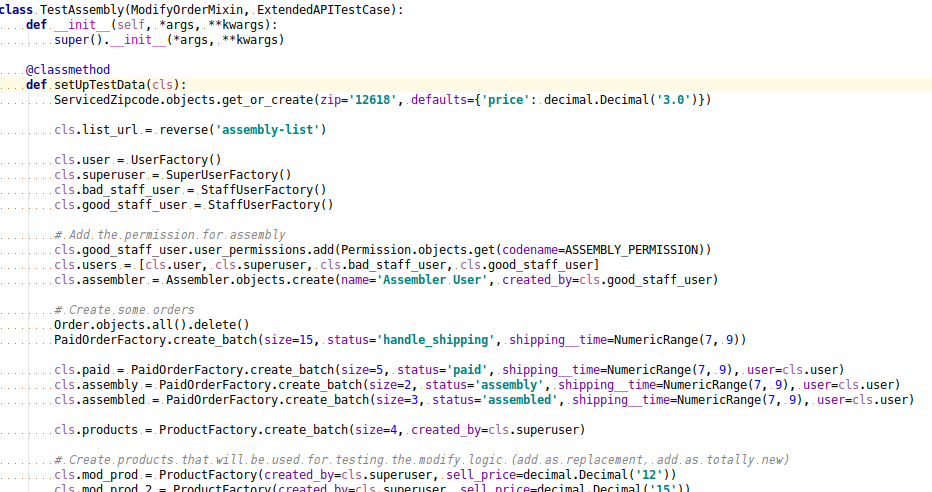

# py.test fixtures

Jürno Ader

- Twitter: [@jyrno42](https://twitter.com/jyrno42)
- GitHub: [github.com/jyrno42](https://github.com/jyrno42)
- Slides: [github.com/jyrno42/knowledge_pytest_fixtures](https://github.com/jyrno42/knowledge_tg_resources)

Note:

    Hello! Today I will talk about py.test features: fixtures and functional tests.

***

## Most of us have seen something like:




---

Or even this:



---

## Yeah... So what?

- Lots of duplicated code (style promotes boilerplate usage)
- Tests are functions but their setup code is shared
- readability issues

***

## What are fixtures?

The purpose of a test fixture is to provide a fixed baseline upon which tests can reliably
and repeatedly execute. 

---

## Fixtures are awesome:

- Provide test-dependency injection
- isolated
- Composable

---

## How do they look like?

```
@pytest.fixture(scope='function')
def foo_fixture():
    return 'foo'
```

---

## Real-life example

```
class CartTestCase(TestCase):
    def setUp(self):
        self.empty_cart = Cart.objects.create()

    def test_empty_cart_fails_validation(self):
        with self.assertRaises(ValidationError) as e:
            validate_cart(self.empty_cart)

        self.assertEqual(e.exception.code, 'empty-cart')
```

Note: 

    We start off with a test-case written using django-s built-in unittest style. The test-case
    contains a common setUp function and a test which checks that empty carts
    fail validation.

---

**Creating a fixture from setUp**

```
@pytest.fixture(scope='function')
def empty_cart():
    return Cart.objects.create()
```

---

**Remove setUp method**

```diff
 class CartTestCase(TestCase):
-    def setUp(self):
-        self.empty_cart = Cart.objects.create()
-
```

---

**Use the fixture in our tests**

```diff
 class CartTestCase(TestCase):
-    def test_empty_cart_fails_validation(self):
+    def test_empty_cart_fails_validation(self, empty_cart):
         with self.assertRaises(ValidationError) as e:
-            validate_cart(self.empty_cart)
+            validate_cart(empty_cart)
         self.assertEqual(e.exception.code, 'empty-cart')
```

---

**we end up with**

```
@pytest.fixture(scope='function')
def empty_cart():
    return Cart.objects.create()


class CartTestCase(TestCase):
    def test_empty_cart_fails_validation(self, empty_cart):
        with self.assertRaises(ValidationError) as e:
            validate_cart(empty_cart)

        self.assertEqual(e.exception.code, 'empty-cart')
```

---

**Can we reduce boiler-plate even further?**

---

```diff
-class CartTestCase(TestCase):
-    def test_empty_cart_fails_validation(self, empty_cart):
-        with self.assertRaises(ValidationError) as e:
-            validate_cart(empty_cart)
-
-        self.assertEqual(e.exception.code, 'empty-cart')
-
+def test_empty_cart_fails_validation(empty_cart):
+    with pytest.raises(ValidationError) as exc_info:
+        validate_cart(empty_cart)
+
+    assert exc_info.value.code == 'empty-cart'
```

Note:

    how is this better than the unittest style? next slides should give an answer

***

## Composability

**A fixture can use other fixtures:**

```
@pytest.fixture(scope='function')
def user():
    return User.objects.create()


@pytest.fixture(scope='function')
def empty_cart():
    return Cart.objects.create()

@pytest.fixture(scope='function')
def empty_cart_for_user(empty_cart, user):
    empty_cart.user = user
    empty_cart.save()

    return empty_cart
```

---

```
@pytest.fixture(scope='function')
def other_user():
    return User.objects.create()

def test_cart_is_owner(empty_cart_for_user, user, other_user):
    # user should be owner
    assert empty_cart_for_user.is_owner(user)

    # other user should not be an owner
    assert not empty_cart_for_user.is_owner(other_user)
```

***

## Isolation - fixture scope

Py.test fixtures can be defined using different scopes:

- function - *the default*
  - fixture is executed once per test function
- class
  - fixture is executed once per test class
- module
  - fixture is executed once per test module (file)
- session
  - fixture is executed once per testing session

---

## Isolation - overwriting fixtures per-module

```
# content of conftest.py
@pytest.fixture(scope='function')
def foo_fixture():
    return 'foo'

# content of test.py
@pytest.fixture(scope='function')
def foo_fixture(foo_fixture):
    return '{0}:bar'.format(foo_fixture)

def test_fixture_overwritten(foo_fixture):
    assert foo_fixture == 'foo:bar' # passes
```

Note:

- Teardown is easy since fixtures have builtin support for it.
- Tests are automatically grouped by fixture instances

***

## Thank you

- Slides: [github.com/jyrno42/knowledge_tg_pytest_fixtures](https://github.com/jyrno42/knowledge_tg_pytest_fixtures)

